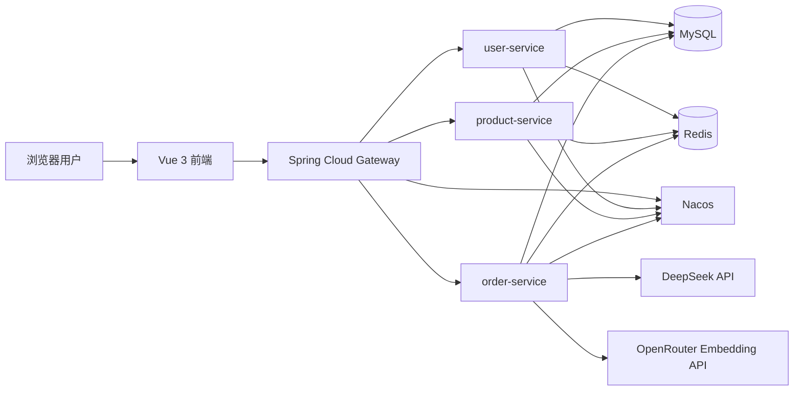

# PhoneMall 手机电商平台

<p align="center">
  基于 Spring Cloud 微服务架构与 Vue 3 构建的手机电商平台
</p>

<p align="center">
  
  
  
  
  
  
</p>

## 项目介绍

PhoneMall 是一个面向手机商品销售场景的前后端分离电商平台。项目采用 Spring Cloud 微服务架构，将用户、商品、订单等业务拆分为独立服务，并通过 API 网关统一提供访问入口。

系统实现了用户注册登录、商品查询、购物车、收货地址、事务化下单、库存管理、模拟支付、订单管理等主要电商功能。同时接入大语言模型与向量检索能力，为用户提供基于商品数据的 AI 智能导购服务。

本项目适合作为 Java 微服务、前后端分离、电商业务和 AI 应用集成方向的学习与毕业设计项目。

## 功能模块

### 用户中心

- 用户注册与登录
- JWT 身份认证
- Access Token 与 Refresh Token
- 用户资料查看和修改
- 收货地址新增、修改、删除
- 默认收货地址设置

### 商品中心

- 商品分页展示
- 商品详情查看
- 商品名称与关键词搜索
- 品牌、分类和价格区间筛选
- 按销量或价格排序
- 热门商品推荐
- Redis 商品详情缓存
- 热门商品与筛选项缓存

### 购物车

- 商品加入购物车
- 商品数量修改
- 商品规格选择
- 单项删除与批量删除
- 商品选中状态切换
- 全选与取消全选
- 购物车数量统计

### 订单中心

- 提交订单
- 同步事务创建订单与订单明细
- Redis Lua 原子预扣库存
- MySQL 库存确认
- 防止重复提交
- 订单详情与分页查询
- 模拟支付
- 用户取消订单
- 未支付订单超时处理
- 库存自动恢复

### AI 智能导购

- 根据自然语言描述购机需求
- 商品信息向量化
- 基于余弦相似度检索相关商品
- RAG 检索增强生成
- DeepSeek 生成推荐结果
- SSE 流式输出
- 用户历史对话记录
- AI 自动丰富商品描述

### 网关与服务治理

- Spring Cloud Gateway 统一入口
- Nacos 服务注册与发现
- JWT 全局鉴权
- Sentinel 网关限流
- 跨域访问配置
- 基于服务名的负载均衡路由

## 系统架构



## 技术栈

### 后端

| 技术 | 用途 |
| --- | --- |
| Java 17 | 后端开发语言 |
| Spring Boot 3.2.5 | 微服务基础框架 |
| Spring Cloud 2023.0.2 | 微服务治理 |
| Spring Cloud Alibaba | Nacos 服务发现 |
| Spring Cloud Gateway | API 网关与统一路由 |
| Sentinel | 网关流量控制 |
| MyBatis-Plus | 数据持久层与分页查询 |
| MySQL 8.0 | 业务数据存储 |
| Redis / Redisson | 缓存、幂等和库存预扣 |
| JJWT | JWT 生成与解析 |
| Knife4j | 在线接口文档 |
| Hutool | 常用工具与数据处理 |
| Lombok | 简化 Java 代码 |

### 前端

| 技术 | 用途 |
| --- | --- |
| Vue 3 | 前端框架 |
| TypeScript | 类型支持 |
| Vite | 开发与构建工具 |
| Element Plus | UI 组件库 |
| Pinia | 状态管理 |
| Vue Router | 前端路由 |
| Axios | HTTP 请求 |

### AI 能力

| 技术 | 用途 |
| --- | --- |
| DeepSeek API | 推荐内容生成与商品描述生成 |
| OpenRouter Embedding API | 商品和查询文本向量化 |
| RAG | 根据用户需求检索相关商品 |
| SSE | AI 回答流式传输 |

### 部署与运维

- Docker
- Docker Compose
- Nginx
- FRP
- Shell 脚本

## 项目结构

```text
biyesheji
├── biyesheji-common/          # 公共模块：实体、DTO、VO、工具类、异常处理
├── gateway-service/           # API 网关、JWT 鉴权、Sentinel 限流
├── user-service/              # 用户、登录、个人资料和收货地址
├── product-service/           # 商品查询、搜索、筛选和缓存
├── order-service/             # 购物车、订单、库存和 AI 导购
├── biyesheji-frontend/        # Vue 3 前端项目
├── sql/
│   ├── init.sql               # 数据库表结构
│   └── mock_data.sql          # 示例商品与业务数据
├── docker/                    # MySQL、Redis、Nacos 编排文件
├── deploy/                    # Nginx、FRP 和服务器部署脚本
├── docs/                      # 项目说明与辅助脚本
├── scripts/                   # 文档生成相关脚本
├── start.sh                   # 项目管理脚本
└── pom.xml                    # Maven 父工程
```

## 服务端口

| 服务 | 默认端口 | 说明 |
| --- | ---: | --- |
| gateway-service | 8080 | API 统一入口 |
| user-service | 8081 | 用户服务 |
| product-service | 8082 | 商品服务 |
| order-service | 8083 | 订单与 AI 服务 |
| 前端开发服务器 | 5173 | Vue 开发环境 |
| MySQL | 3306 | 关系型数据库 |
| Redis | 6379 | 缓存服务 |
| Nacos | 8848 | 注册中心 |

## 环境要求

运行项目前，请准备以下环境：

- Git
- Docker
- Docker Compose
- Java 17 或更高版本
- Maven
- Node.js 与 npm

使用项目自带的 Docker 构建脚本时，本机可以不单独安装 Maven 和 Java 17，但需要能够正常运行 Docker。

## 快速启动

### 1. 克隆项目

```bash
git clone https://github.com/yuyukosama2004/biyesheji.git
cd biyesheji
```

### 2. 配置运行环境

```bash
cp .env.example .env
# 编辑 .env：必须设置 MYSQL_ROOT_PASSWORD、REDIS_PASSWORD、JWT_SECRET；
# Docker 部署还应保留 MYSQL_HOST=mysql、REDIS_HOST=redis、NACOS_SERVER_ADDR=nacos:8848。
```

`.env` 不会提交到 Git。JWT 密钥至少为 32 字节；不要把真实 AI Key 或数据库口令写回配置文件。

### 3. 启动基础设施

项目提供了 MySQL、Redis 和 Nacos 的 Docker Compose 配置：

```bash
docker compose -f docker/docker-compose.infrastructure.yml up -d
```

也可以使用项目脚本：

```bash
chmod +x start.sh
./start.sh infra-start
```

首次创建 MySQL 容器时，会自动执行：

```text
sql/init.sql
sql/mock_data.sql
```

### 4. 配置 AI 密钥

AI 导购需要设置 DeepSeek 和 OpenRouter API 密钥。

Linux 或 macOS：

```bash
export DEEPSEEK_API_KEY="你的 DeepSeek API Key"
export OPENROUTER_API_KEY="你的 OpenRouter API Key"
```

Windows PowerShell：

```powershell
$env:DEEPSEEK_API_KEY="你的 DeepSeek API Key"
$env:OPENROUTER_API_KEY="你的 OpenRouter API Key"
```

未配置 AI 密钥时，用户、商品、购物车和订单等基础电商功能仍可独立运行。

### 5. 构建后端

使用本机 Maven：

```bash
./mvnw verify
```

使用项目脚本和 Docker Maven 镜像：

```bash
./start.sh build
```

### 6. 启动微服务

使用项目脚本：

```bash
./start.sh start
```

脚本会依次启动：

1. user-service
2. product-service
3. order-service
4. gateway-service

也可以在不同终端中手动启动：

```bash
java -jar user-service/target/user-service-1.0.0.jar
java -jar product-service/target/product-service-1.0.0.jar
java -jar order-service/target/order-service-1.0.0.jar
java -jar gateway-service/target/gateway-service-1.0.0.jar
```

### 7. 启动前端

```bash
cd biyesheji-frontend
npm ci
npm run dev
```

浏览器访问：

```text
http://localhost:5173
```

后端统一入口：

```text
http://localhost:8080
```

## 项目脚本

```bash
./start.sh <command>
```

| 命令 | 说明 |
| --- | --- |
| `infra-start` | 启动 MySQL、Redis 和 Nacos |
| `infra-stop` | 停止基础设施 |
| `build` | 构建全部后端模块 |
| `start` | 通过应用 Compose 构建并启动四个微服务 |
| `stop` | 停止并删除应用服务容器，不删除数据卷 |
| `restart` | 重建并重启应用服务容器 |
| `status` | 查看容器和服务状态 |
| `all` | 启动基础设施、构建后端并启动微服务 |

首次运行建议依次执行：

```bash
./start.sh infra-start
./start.sh build
./start.sh start
```

`start` 会复用 `docker/docker-compose.app.yml`，并等待四个应用服务的
`/actuator/health` 健康检查通过。网关仅绑定在 `127.0.0.1`；如宿主机的
8080 已被占用，请在 `.env` 设置 `GATEWAY_HOST_PORT`，并让 Nginx 指向该端口。

## API 路由

网关会按照请求路径将流量转发到不同服务：

| 路径 | 目标服务 |
| --- | --- |
| `/api/user/**` | user-service |
| `/api/product/**` | product-service |
| `/api/order/**` | order-service |

### 用户接口示例

```text
POST /api/user/register
POST /api/user/login
POST /api/user/refresh
GET  /api/user/info
PUT  /api/user/info
GET  /api/user/address
POST /api/user/address
```

### 商品接口示例

```text
GET /api/product/page
GET /api/product/{id}
GET /api/product/hot
GET /api/product/filters
```

商品分页查询示例：

```text
GET /api/product/page?pageNum=1&pageSize=12&brand=Apple&sort=price_asc
```

### 购物车接口示例

```text
POST   /api/order/cart
GET    /api/order/cart
PUT    /api/order/cart/{cartId}
DELETE /api/order/cart/{cartId}
PUT    /api/order/cart/check-all
GET    /api/order/cart/count
```

### 订单接口示例

```text
POST /api/order/submit
GET  /api/order/page
GET  /api/order/{orderNo}
POST /api/order/{orderNo}/pay
POST /api/order/{orderNo}/cancel
```

### AI 导购接口

```text
GET /api/order/ai/chat?query=预算三千元，想要续航好并且适合拍照的手机
```

该接口通过 SSE 持续返回生成内容。

## 接口文档

后端服务启动后，可以访问 Knife4j 接口文档：

```text
用户服务：http://localhost:8081/doc.html
商品服务：http://localhost:8082/doc.html
订单服务：http://localhost:8083/doc.html
```

## 核心业务流程

### 用户登录流程

```text
用户提交账号密码
        ↓
用户服务校验 BCrypt 密码
        ↓
生成 Access Token 和 Refresh Token
        ↓
前端保存 Token
        ↓
后续请求携带 Authorization: Bearer <Token>
        ↓
网关统一完成 JWT 校验
```

### 下单与库存流程

```text
用户提交订单
      ↓
校验商品并计算订单金额
      ↓
Redis Lua 原子预扣库存
      ↓
在同一事务中创建订单和订单明细
      ↓
保持库存预留，支付时确认扣减，取消或超时则释放
```

### AI 导购流程

```text
用户输入购机需求
      ↓
将查询文本转换为向量
      ↓
与商品向量计算余弦相似度
      ↓
召回最相关的商品
      ↓
将商品数据与用户需求组合为提示词
      ↓
调用 DeepSeek 生成推荐内容
      ↓
通过 SSE 流式返回前端
```

## 数据库设计

主要数据表如下：

| 表名 | 说明 |
| --- | --- |
| `t_user` | 用户信息 |
| `t_address` | 收货地址 |
| `t_product` | 手机商品 |
| `t_shopping_cart` | 购物车 |
| `t_order` | 订单主表 |
| `t_order_item` | 订单明细 |
| `t_stock` | 商品库存 |
| `t_ai_conversation` | AI 对话记录 |
| `undo_log` | 分布式事务预留表 |

数据库初始化文件位于：

```text
sql/init.sql
```

示例数据文件位于：

```text
sql/mock_data.sql
```

## 前端页面

前端目前包含以下主要页面：

- 首页
- 用户登录
- 用户注册
- 商品列表
- 商品详情
- 购物车
- 订单结算
- 订单列表
- 订单详情
- 个人账户
- AI 智能导购

## Docker 部署

基础设施低配版：

```bash
docker compose -f docker/docker-compose.infrastructure.yml up -d
```

推荐使用项目脚本启动完整后端。它会先构建 JAR，再构建运行时镜像，并通过
`docker-compose.app.yml` 启动应用服务：

```bash
./start.sh all
```

应用服务与 MySQL、Redis、Nacos 使用私有 Docker 网络；对宿主机仅暴露可配置的
网关回环端口。Nginx 应将 `/api/` 反向代理到 `127.0.0.1:${GATEWAY_HOST_PORT}`。

E5 服务器配置：

```bash
docker compose -f docker/docker-compose.e5.yml up -d
```

停止并删除容器：

```bash
docker compose -f docker/docker-compose.infrastructure.yml down
```

部署相关文件位于：

```text
deploy/
```

其中包含：

- Nginx 配置
- FRP 服务端配置
- FRP 客户端配置
- E5 服务器部署脚本
- 云服务器初始化脚本

## 构建前端生产版本

```bash
cd biyesheji-frontend
npm ci
npm run build
```

构建产物默认生成在：

```text
biyesheji-frontend/dist
```

可使用 Nginx 部署该目录，并将 `/api/` 请求反向代理到网关服务的 `8080` 端口。

## 项目特点

- 使用微服务方式拆分用户、商品和订单业务
- 通过网关统一完成路由、鉴权和限流
- 使用 Redis Lua 实现原子库存操作
- 使用同步事务确保订单落库与库存预留的一致性
- 使用 Redis 缓存提高商品查询效率
- 使用定时任务处理超时订单
- 使用 Vue 3 与 Element Plus 构建完整前端页面
- 将 RAG、向量检索、SSE 和大语言模型集成到传统电商业务
- 提供 Docker、Nginx、FRP 和服务器部署脚本

## 使用说明

本项目主要用于毕业设计、课程设计与技术学习。运行 AI 功能时，第三方模型接口可能产生费用，请根据对应平台的计费规则合理使用。
